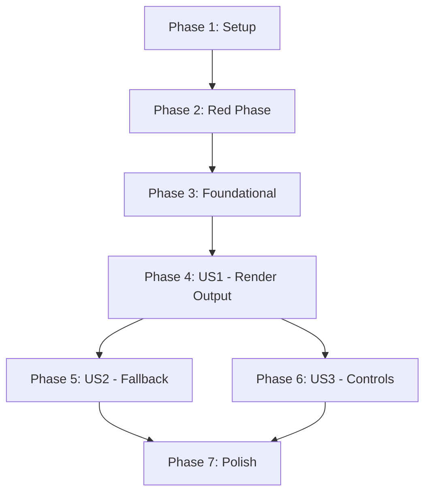

# Tasks: Wayland Display Driver Support

**Feature Branch**: `002-wayland-display-driver`
**Implementation Plan**: `specs/002-wayland-display-driver/plan.md`

## Implementation Strategy

We follow a strict **TDD-first** approach as mandated by the project constitution. All test cases for the entire feature set must be established and verified to fail before any implementation code is written. The implementation is then delivered in functional increments starting with the core Wayland surface (US1), followed by fallback logic (US2) and window controls (US3).

## Phase 1: Setup
Initialization of the development environment and basic structure.

- [X] T001 Initialize the feature branch and verify build environment in `src/framebuffer/CMakeLists.txt`
- [X] T002 Create the test directory structure in `tests/framebuffer/`

## Phase 2: Red Phase (Failing Tests)
Establishing the test suite for all user stories. **Mandatory: All tests must fail before proceeding to implementation.**

- [X] T003 [US1] Create failing initialization and presentation tests in `tests/framebuffer/test_fb_wl.cpp`
- [X] T004 [US2] Create failing fallback and detection tests in `tests/framebuffer/test_fb_common.cpp`
- [X] T005 [US3] Create failing tests for resize, close, and input events in `tests/framebuffer/test_fb_wl.cpp`

## Phase 3: Foundational
Blocking prerequisites for all user stories.

- [X] T006 Update `src/framebuffer/CMakeLists.txt` to detect Wayland libraries (libwayland-client) and wayland-protocols (v1.24+), and define the `fbwl` module target
- [X] T007 [P] Create `src/framebuffer/fbwl.h` and skeleton `src/framebuffer/fbwl.cpp` with the `CWDisplay` class definition

## Phase 4: [US1] Render Output to Wayland Display (P1)
Goal: Display rendered frames on a Wayland surface.
Test Criteria: A window appears showing the rendered image on a Wayland compositor.

- [X] T008 [P] [US1] Implement Wayland connection and registry listener for shm and shell in `src/framebuffer/fbwl.cpp`
- [X] T009 [P] [US1] Implement `wl_shm` buffer allocation and management in `src/framebuffer/fbwl.cpp`
- [X] T010 [US1] Implement basic surface frame presentation logic in `src/framebuffer/fbwl.cpp`
- [X] T011 [US1] Implement `displayStart`, `displayData`, and `displayFinish` plugin exports in `src/framebuffer/fbwl.cpp`

## Phase 5: [US2] Graceful Fallback (P2)
Goal: Automatically select Wayland if available, otherwise use X11.
Test Criteria: System correctly identifies and uses the appropriate backend based on environment.

- [X] T012 [US2] Implement runtime Wayland detection logic in `src/framebuffer/framebuffer.cpp`
- [X] T013 [US2] Update `displayStart` in `src/framebuffer/framebuffer.cpp` to prioritize `fbwl` over `fbx` on Linux

## Phase 6: [US3] Display Window Controls (P3)
Goal: Support resize, close, and threading for responsive UI.
Test Criteria: Window can be resized/closed without freezing the renderer; HiDPI displays show crisp content.

- [X] T014 [US3] Implement dedicated event thread with `pthread` for the Wayland event loop in `src/framebuffer/fbwl.cpp`
- [X] T015 [US3] Implement buffer re-allocation on window resize events in `src/framebuffer/fbwl.cpp`
- [X] T016 [US3] Implement window close and compositor disconnect event handlers in `src/framebuffer/fbwl.cpp`
- [X] T017 [P] [US3] Implement HiDPI scaling (integer and fractional) support in `src/framebuffer/fbwl.cpp`
- [X] T018 [P] [US3] Implement basic input event propagation in `src/framebuffer/fbwl.cpp`

## Phase 7: Polish & Cross-Cutting Concerns
Finalizing logging, documentation, and metrics verification.

- [X] T019 Integrate `src/includes/logging.hpp` macros for all lifecycle and error events in `src/framebuffer/fbwl.cpp`
- [X] T020 [P] Create User Guide and Troubleshooting documentation in `site/content/docs/`
- [X] T021 [P] Configure site deployment workflow in `.github/workflows/deploy-site.yml` (SC-002 alignment)
- [X] T022 Verify performance metrics (latency < 33ms, memory < 20MB) using custom benchmarking scripts (SC-002, SC-005)
- [X] T023 Perform security validation for socket permissions (SEC-001) and buffer safety (SEC-002, SEC-003)
- [X] T024 Final verification of cross-platform build compatibility for Linux and macOS
- [X] T025 [US2] Create integration test to verify concurrent multi-display output (Wayland + X11 + File) as per FR-008

## Dependency Graph

## Parallel Execution Examples

- **Foundational**: T007 (Header/Skeleton) can be prepared while T006 (CMake) is being configured.
- **Within US1**: T008 and T009 can be developed in parallel as they cover different parts of the Wayland connection/buffer setup.
- **Within US3**: T017 (HiDPI) and T018 (Input) can be implemented independently.
- **Polish**: T020, T021, and T022 can be executed simultaneously after core logic is verified.
